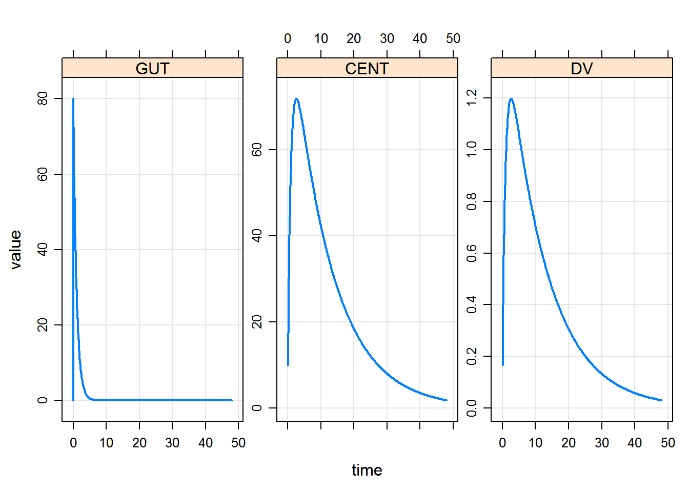

---
title: "example_model_sourcing"
output: html_document
---


```r
library(mrgsolve)
#> Loading required package: methods
#> mrgsolve: Community Edition
#> www.github.com/metrumresearchgroup/mrgsolve
```

By sourcing the model file, the overseer model cache is pulled in and can 
be used directly. Since it handles everything relative to the Rscript in which 
is created, rather than where it is being sourced _from_, no changes have to be
made to how models are constructed, cached, etc.


```r
models <- source("../models/models.R")$value
#> model dir set to C:/Users/devin/Documents/Repos/example_overseer/models
#> cache location set to C:\Users\devin\Documents\Repos\example_overseer\models\.modelcache
#> Compiling mod_simple ...
#> done.
```


```r
models$available()
#> [1] "mod_simple" "one_cmt_f"
```


```r
one_cmt_f <- models$use("one_cmt_f")
#> Compiling one_cmt_f ...
#> done.

one_cmt_f %>%
    ev(amt = 100) %>% mrgsim %>% plot
```




```r
devtools::session_info()
#> Session info -------------------------------------------------------------
#>  setting  value                       
#>  version  R version 3.3.2 (2016-10-31)
#>  system   x86_64, mingw32             
#>  ui       RTerm                       
#>  language (EN)                        
#>  collate  English_United States.1252  
#>  tz       America/New_York            
#>  date     2017-02-06
#> Packages -----------------------------------------------------------------
#>  package       * version     date      
#>  assertthat      0.1         2013-12-06
#>  backports       1.0.5       2017-01-18
#>  bookdown        0.2         2016-11-12
#>  codetools       0.2-15      2016-10-05
#>  DBI             0.5-1       2016-09-10
#>  devtools        1.12.0.9000 2017-02-05
#>  digest          0.6.12      2017-01-27
#>  dplyr           0.5.0       2016-06-24
#>  evaluate        0.10        2016-10-11
#>  htmltools       0.3.5       2016-03-21
#>  httpuv          1.3.3       2015-08-04
#>  knitr           1.15.1      2016-11-22
#>  lattice         0.20-34     2016-09-06
#>  lazyeval        0.2.0       2016-06-12
#>  magrittr        1.5         2014-11-22
#>  memoise         1.0.0       2016-01-29
#>  mime            0.5         2016-07-07
#>  miniUI          0.1.1       2016-01-15
#>  mrgsolve      * 0.7.6.9030  2016-12-16
#>  overseer      * 0.0.4       2017-02-05
#>  pkgbuild        0.0.0.9000  2017-02-05
#>  pkgload         0.0.0.9000  2017-02-05
#>  R6              2.2.0       2016-10-05
#>  Rcpp            0.12.9      2017-01-14
#>  RcppArmadillo   0.7.500.0.0 2016-10-22
#>  rmarkdown       1.3.9002    2017-02-05
#>  rprojroot       1.2         2017-01-16
#>  shiny           0.14.2.9001 2017-01-10
#>  stringi         1.1.2       2016-10-01
#>  stringr         1.1.0       2016-08-19
#>  tibble          1.2         2016-08-26
#>  withr           1.0.2       2016-06-20
#>  xtable          1.8-2       2016-02-05
#>  yaml            2.1.14      2016-11-12
#>  source                                       
#>  CRAN (R 3.3.2)                               
#>  CRAN (R 3.3.2)                               
#>  CRAN (R 3.3.2)                               
#>  CRAN (R 3.3.2)                               
#>  CRAN (R 3.3.2)                               
#>  Github (hadley/devtools@d8ab190)             
#>  CRAN (R 3.3.2)                               
#>  CRAN (R 3.3.2)                               
#>  CRAN (R 3.3.2)                               
#>  CRAN (R 3.3.2)                               
#>  CRAN (R 3.3.2)                               
#>  CRAN (R 3.3.2)                               
#>  CRAN (R 3.3.2)                               
#>  CRAN (R 3.3.2)                               
#>  CRAN (R 3.3.2)                               
#>  CRAN (R 3.3.2)                               
#>  CRAN (R 3.3.2)                               
#>  CRAN (R 3.3.2)                               
#>  Github (metrumresearchgroup/mrgsolve@8028ac5)
#>  Github (dpastoor/overseer@9765e80)           
#>  Github (r-pkgs/pkgbuild@65eace0)             
#>  Github (r-pkgs/pkgload@def2b10)              
#>  CRAN (R 3.3.2)                               
#>  CRAN (R 3.3.2)                               
#>  CRAN (R 3.3.2)                               
#>  Github (rstudio/rmarkdown@c4908dc)           
#>  CRAN (R 3.3.2)                               
#>  Github (rstudio/shiny@f66a766)               
#>  CRAN (R 3.3.2)                               
#>  CRAN (R 3.3.2)                               
#>  CRAN (R 3.3.2)                               
#>  CRAN (R 3.3.2)                               
#>  CRAN (R 3.3.2)                               
#>  CRAN (R 3.3.2)
```


